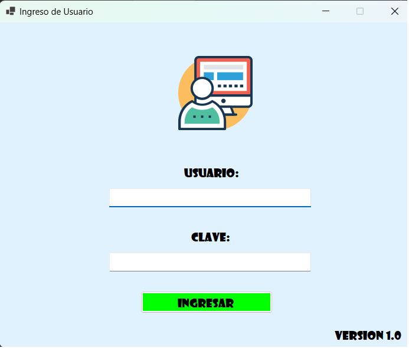
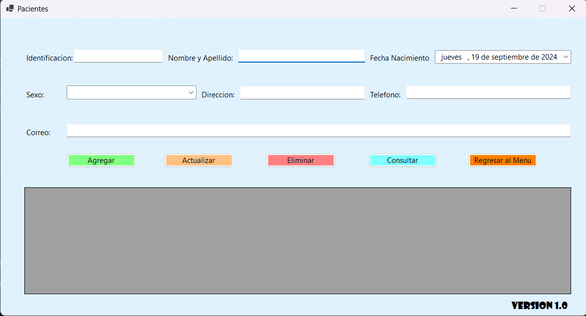
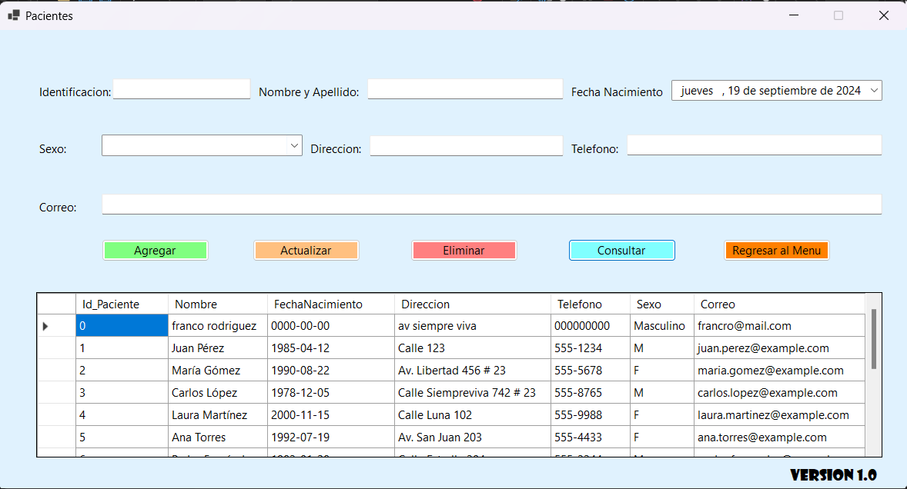
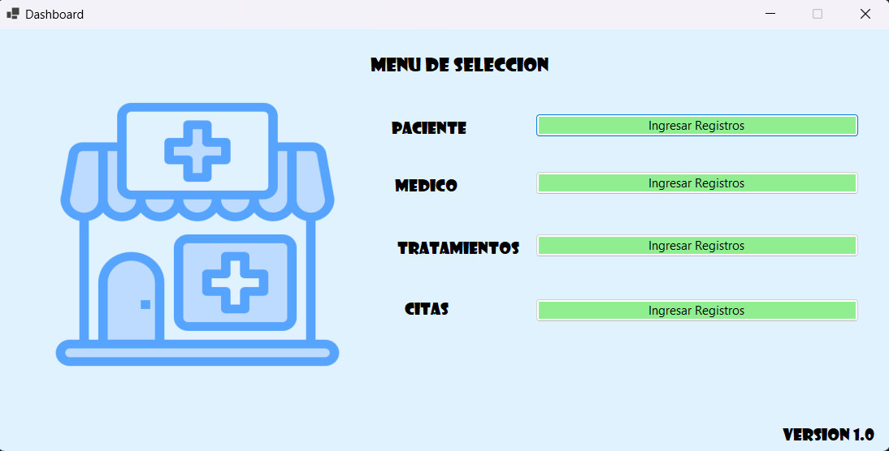

# Sistema de Gestión de Clínica
## Desarrollado por: Henry Garcia

Este proyecto es un **Sistema de Gestión de Clínica** desarrollado en C# con una interfaz gráfica (GUI) utilizando Windows Forms, y MySQL como base de datos. El sistema permite gestionar pacientes, médicos, citas y tratamientos mediante operaciones CRUD (Crear, Leer, Actualizar y Eliminar).




## Características

- **Gestión de pacientes**: Registrar, consultar, actualizar y eliminar pacientes.
  

  
- **Gestión de médicos**: Administrar el personal médico de la clínica.
- **Gestión de citas**: Programar, modificar y eliminar citas médicas.
- **Gestión de tratamientos**: Control y seguimiento de los tratamientos para cada paciente.
- **Interfaz gráfica intuitiva**: Interacción sencilla con el sistema mediante formularios Windows Forms.
  
- **Conexión con base de datos MySQL**: Los datos se almacenan de forma segura en una base de datos MySQL.

## Tecnologías utilizadas

- **Lenguaje de programación**: C#
- **Framework**: .NET Framework
- **Base de datos**: MySQL
- **Interfaz gráfica**: Windows Forms
- **ORM**: MySql.Data (para conectar con MySQL)

## Configuración del proyecto

### Requisitos previos

1. **MySQL**: Debes tener MySQL instalado y una base de datos configurada. Asegúrate de ejecutar los scripts SQL proporcionados para crear las tablas necesarias en la base de datos.
2. **.NET Framework**: Asegúrate de tener instalado el .NET Framework 4.7 o superior.
3. **Visual Studio**: Recomendado para editar y ejecutar el proyecto.

### Instalación

1. Clona el repositorio en tu máquina local:
    ```bash
    git clone https://github.com/tu_usuario/clinicaApp.git
    cd clinica_sistema
    ```

2. Configura la cadena de conexión a la base de datos MySQL en el archivo `Database.cs`:
    ```csharp
    private string connectionString = "Server=localhost;Database=clinica;Uid=tu_usuario;Pwd=tu_contraseña;";
    ```

3. Asegúrate de ejecutar los scripts SQL para crear las tablas de la base de datos:
    - `Pacientes`
    - `Medicos`
    - `Citas`
    - `Tratamientos`

### Base de datos

Este es un ejemplo de la estructura de la tabla **Pacientes**:

```sql
CREATE TABLE Pacientes (
    PacienteID INT AUTO_INCREMENT PRIMARY KEY,
    Identificacion VARCHAR(50),
    Nombre VARCHAR(100),
    FechaNacimiento DATE,
    Sexo VARCHAR(10),
    Direccion VARCHAR(150),
    Telefono VARCHAR(15),
    Correo VARCHAR(100)
);

